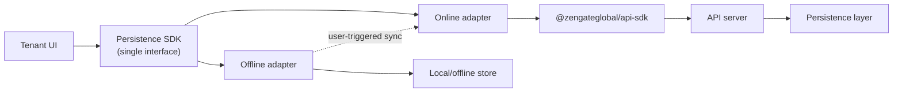

# `@zengateglobal/persistence-sdk` — Tenant Persistence Client SDK

The `@zengateglobal/persistence-sdk` is the tenant-facing TypeScript client that turns Palmyra Pro's document-oriented persistence layer into a simple, high-level storage API for frontend apps.
Instead of dealing with raw HTTP calls, OpenAPI operations, low-level schema plumbing, managing local storage or sync data, tenant UIs work with a small set of opinionated primitives that feel like in-memory collections: read, write, and query immutable entity documents while the SDK quietly handles schema versions, validation boundaries, multi-tenant isolation, and offline storage plus **explicit, user-triggered sync** flows.
Internally, it sits on top of the same backend persistence layer used by, for example, the admin tooling and REST API, but exposes a deliberately narrower, UX-driven surface tailored to tenant scenarios (browsing, enriching, and consuming data) rather than low-level persistence features.

## 1. Goals & Non-Goals

### Goals

- Provide a simple document storage API for tenant UIs that feels like working with in-memory collections instead of remote persistence primitives, with strongly-typed operations and metadata where possible.
- Encapsulate all interaction with the persistence layer (including schema versions, validation boundaries, and multi-tenant isolation) behind a small, ergonomic TypeScript surface.
- Offer built-in support for offline-first usage: local caching, optimistic writes, and user-triggered synchronization with visible progress, instead of automatic background sync.
- Expose read/write/query operations that are safe by default (immutable documents, versioned updates, explicit pagination and filtering) and aligned with the platform’s schema governance rules.
- Integrate cleanly with modern frontend patterns (React hooks, stores, or simple async helpers) without forcing a specific state-management framework on consumers.
- Provide a consistent error model that mirrors backend ProblemDetails where relevant, while translating low-level failures into friendly error objects.

### Non-Goals

- It is not a generic “local database” for arbitrary data; offline storage and sync are scoped to persistence-backed entities defined by Palmyra Pro's schema repository.
- This SDK is not a generic HTTP client or a replacement for `@zengateglobal/api-sdk`; it targets the persistence layer abstraction, not the full REST surface area.
- It is not an admin or operator SDK: schema authoring, moderation workflows, and advanced curation tools belong in the admin persistence and API clients.
- It does not own authentication or token lifecycle management; callers are responsible for acquiring and refreshing auth tokens and wiring them into the SDK’s configuration.

## 2. Architectural Overview

At a high level, `@zengateglobal/persistence-sdk` sits between tenant UIs and the backend persistence layer, providing a single, stable interface that can be backed by either an **online** or an **offline** implementation:

### 2.1 Single interface, two interchangeable implementations

- The SDK exposes one primary TypeScript interface (conceptually a `PersistenceClient`) that defines all tenant-facing operations: read, write, query, and sync of entity documents.
- Both the **online** and **offline** implementations adhere to this interface, so calling code can be written once and configured to use either implementation (or switch between them) without code changes.
- The choice of implementation is made via configuration (for example, an explicit factory), not via inheritance hierarchies. The interface focuses on behavior, while concrete adapters handle transport and storage details.

### 2.2 Online adapter (default path)

- The online adapter is a thin, typed wrapper around `@zengateglobal/api-sdk`, reusing its generated TypeScript types for transport-level concerns while exposing document-centric operations through the persistence SDK interface.
- For each high-level persistence operation, it:
  - obtains a JWT from the configured token provider,
  - calls the appropriate `@zengateglobal/api-sdk` endpoint(s), and
  - maps the results into the document-centric types and invariants expected by the persistence SDK interface.
- All authorization, tenant isolation, and schema-governed validation remain in the backend; the online adapter is responsible for faithfully propagating errors (ProblemDetails) into the SDK’s error model.

### 2.3 Offline adapter (local-first, user-triggered sync)

- The offline adapter implements the same interface, but routes operations through a local storage mechanism (e.g., IndexedDB, in-memory cache, or another persistence primitive) instead of hitting the network on every call.
- It maintains:
  - a local cache of entity documents, scoped by tenant, and
  - a queue of mutations that need to be synchronized when the user explicitly triggers a sync.
- Sync is **not** a background concern: the adapter exposes explicit sync methods and progress reporting so UIs can drive when and how synchronization happens and visualize its status to the user.
- When syncing, the offline adapter delegates to the online adapter (or an equivalent online pipeline), reusing the same JWT-based auth and API routes.

### 2.4 Integration with frontend layers

- The core SDK is framework-agnostic: it exposes plain async methods on the shared interface and does not depend on React or any particular state management library.
- Optional integration layers (e.g., React hooks, store adapters) are thin wrappers around the shared interface, making it straightforward to:
  - swap online/offline implementations without changing UI code, and
  - test application logic by injecting mock implementations that also conform to the same interface.

## 3. Core Responsibilities

> TBC: Enumerate the concrete responsibilities of the SDK (e.g., read/write entities, handle schema versions, enforce invariants, map persistence concepts into tenant-friendly abstractions) and which concerns stay in the backend.

- [ ] Ensure all in-memory and offline caches are tenant-aware: never mix data across different JWTs, partition cached state by `TenantID`, and treat any change in the active token as a signal to reset or re-partition caches to avoid cross-tenant leakage.

## 4. Domain & Data Model

> TBC: Explain the high-level data model exposed to tenants: entities, documents, schema references, versioning concepts, and how these map (or intentionally do not map) to the underlying persistent layer tables.

### 4.1 Typing model for entities

- Entity structures are defined via JSON Schemas that can evolve independently of any given tenant frontend, which means the SDK cannot guarantee that all document payloads are statically known at compile time.
- The SDK will therefore be strongly typed around its public API and metadata (IDs, schema identifiers, versions, pagination, errors, sync operations), while treating document payloads as schema-driven JSON values validated at runtime.
- Callers that want stronger typing for specific schemas can opt in by defining their own TypeScript types and layering them on top of the SDK (e.g., via generics plus runtime validation against the schema repository), but this remains a consumer choice rather than a hard guarantee from the SDK.

## 5. Public API Surface

> TBC: Outline the main modules, entrypoints, and TypeScript types (e.g., clients, repositories, hooks, helpers). Include naming conventions, method patterns (get/save/list), and any generic abstractions that callers will rely on.

## 6. Configuration & Environment

> TBC: Describe required configuration (e.g., base URLs or adapters, auth tokens, environment flags), how configuration is passed (constructor options, providers), and how it aligns with Twelve-Factor practices.

## 7. Authentication, Authorization & Multi-Tenancy

### 7.1 Authentication (JWT as the single entry point)

All authentication for `@zengateglobal/persistence-sdk` is centralized on **JWT bearer tokens**:

- The SDK never issues or refreshes tokens. Callers are responsible for obtaining a valid JWT (via Firebase / Identity Platform, the dev provider or any other implementation) and for managing its lifecycle.
- The SDK treats the JWT as an opaque credential, passing it through to the backend via the underlying `@zengateglobal/api-sdk` client on every call.
- Integrations are expected to configure the SDK with a `getToken`/callback-style provider that returns the latest JWT so the SDK can remain stateless and work with rotating tokens.

In dev mode, the same mechanism works with unsigned JWTs used by the API server; the persistence SDK does not need to distinguish between real and dev providers as long as the token shape is compatible.

### 7.2 Authorization and roles

Authorization decisions remain the responsibility of the backend API:

- Every operation exposed by the persistence SDK ultimately maps to one or more calls to `@zengateglobal/api-sdk`, which in turn hits routes protected by JWT + role middleware.
- The SDK does **not** replicate role logic locally. Instead, it surfaces authorization failures as domain-specific errors derived from backend ProblemDetails (e.g., “forbidden” when the token lacks the required role).
- Custom claims such as `palmyraRoles` and `tenantRoles` are evaluated server-side. The SDK may surface these roles to the caller for conditional UI logic, but it must not be treated as the source of truth for access control.

### 7.3 Multi-Tenancy

Multi-tenant isolation is enforced primarily in the API server, based on the JWT:

- The backend derives the effective `TenantID` from the token (e.g., from the `firebase.tenant` claim) and uses it to scope all persistence operations.
- The persistence SDK assumes that any token it receives is already tenant-scoped and forwards it unchanged to the API via `@zengateglobal/api-sdk`.
- To avoid cross-tenant leakage at the client level, the SDK should:
  - avoid caching data across different JWTs without partitioning by `TenantID`, and
  - treat a change in the active token as a signal to reset or re-partition any in-memory or offline caches.

The net effect is that **tenant isolation is guaranteed by the backend**, while the SDK focuses on:

- reliably attaching the correct JWT to each call, and
- ensuring its own caching / offline mechanisms never mix data associated with different tenants.

## 8. Error Handling & ProblemDetails Mapping

> TBC: Define the error model exposed to consumers, how backend ProblemDetails (RFC 7807) are represented, and patterns for distinguishing validation errors, auth errors, and unexpected failures.

## 9. Usage Patterns & Examples

> TBC: Provide canonical examples for common scenarios (reading entities, writing new versions, querying by filters, paginated lists) in both plain TypeScript and React usage (if applicable).

## 10. Performance, Caching & Limits

> TBC: Document any caching strategy, batching behavior, pagination defaults, and known limits (payload size, rate considerations) plus recommended usage patterns to avoid performance pitfalls.

## 11. Testing, Mocking & Tooling

> TBC: Describe how to test code that depends on this SDK (fixtures, mocks, MSW integration), and any utilities provided for end-to-end tests or storybook-style environments.

## 12. Versioning, Compatibility & Migration

> TBC: Explain how the SDK is versioned (SemVer), how breaking changes are handled, and how consumers should migrate between major versions or persistence-layer schema evolutions.

## 13. Open Questions & Future Work

> TBC: Track unresolved design decisions, potential extensions (offline support, advanced querying, richer type inference), and TODOs for future iterations of the SDK.
